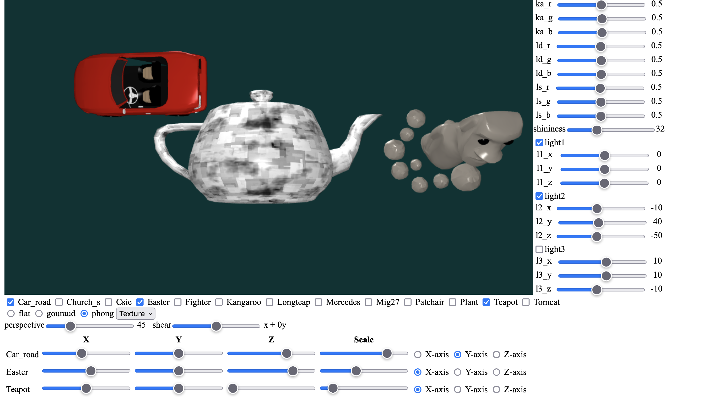

# WebGL-ICG-2022

## HW1 ([Task description](./HW1_rule.pdf))



## Demo

[Demo Link](https://youtu.be/9f0u-vViTL8)

## Deploy

[Deploy Link](https://b06608062.github.io/NTU-2022-Computer-Graphics-WebGL-ICG-HW1/)

## Pre-Learning

- [Learn WebGL](http://learnwebgl.brown37.net/index.html)
- [WebGLFundamentals](https://webglfundamentals.org/webgl/lessons/zh_cn/webgl-fundamentals.html)

## Implementations

- Transformation bar for manipulating each selected model.
- Three light sources from different positions and directions.
- Support for Flat Shading, Gouraud Shading, and Phong Shading.
- Material-specific color coefficients.
- Texture mapping functionality.

## Run in local

1. Download this repository.

```bash
git clone https://github.com/b06608062/NTU-2022-Computer-Graphics-WebGL-ICG-HW1.git
```

1. Install Firefox and set up the environment (refer to [HW1_Guide.pdf](./HW1_Guide.pdf) for details).
2. Open `index.html` in Firefox to view the project.
